# Network Traffic Flow Analysis with Wireshark

## Objective
The purpose of this project is to capture and analyze network traffic at various layers of the OSI model using Wireshark. This lab demonstrates the fundamental flow of web traffic: **DNS → TCP → TLS → HTTP/HTTPS**.

## Tools Used
*   **Kali Linux** (Virtual Machine)
*   **Wireshark** (Network Protocol Analyzer)
*   **Command Line Tools** (curl, ping)

## Core Phases Analysed
1. **DNS Traffic:** Observed how a domain name resolves to an IP address via Standard Queries and Responses.
2. **TCP Traffic:** Captured the TCP 3-Way Handshake (`SYN`, `SYN-ACK`, `ACK`) and followed the connection streams.
3. **HTTP Traffic:** Extracted unencrypted payloads (HTML code) by analyzing plaintext streams.
4. **TLS Traffic:** Analyzed secure TLS handshakes, Cipher Suite negotiations, and Server Certificates.

---

<strong>📁 Click Here to Expand: Full Step-by-Step Lab Execution & Screenshots</strong>

### Step 1 to 5: Initial Setup & Capture
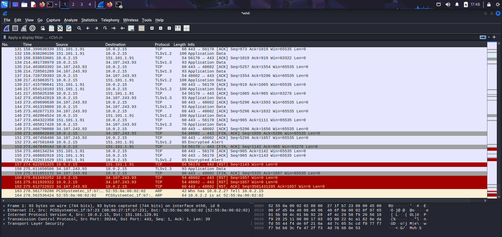
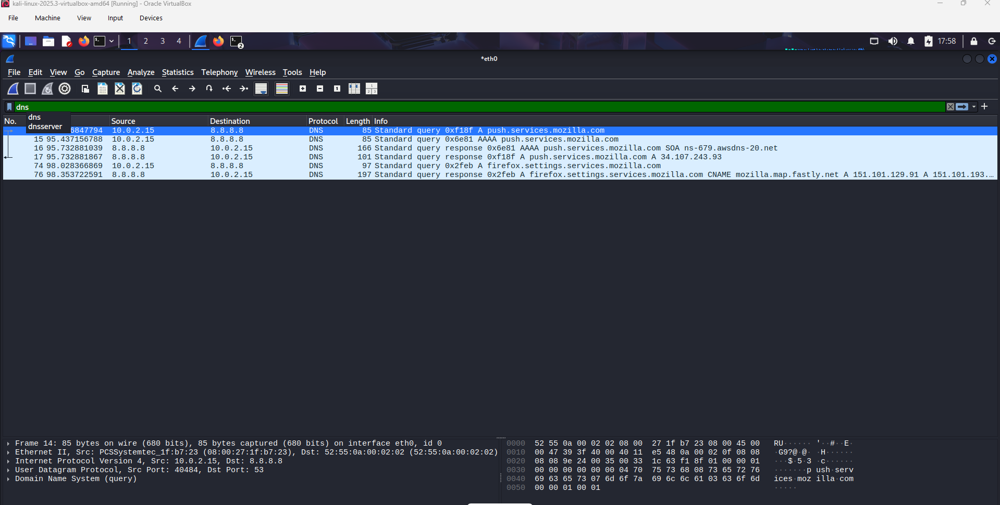

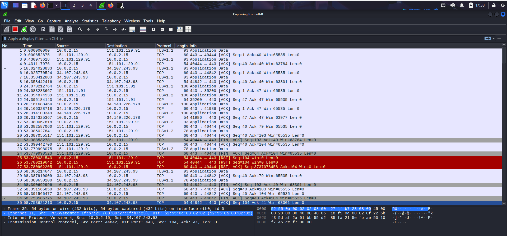

### Step 6 to 10: TCP 3-Way Handshake
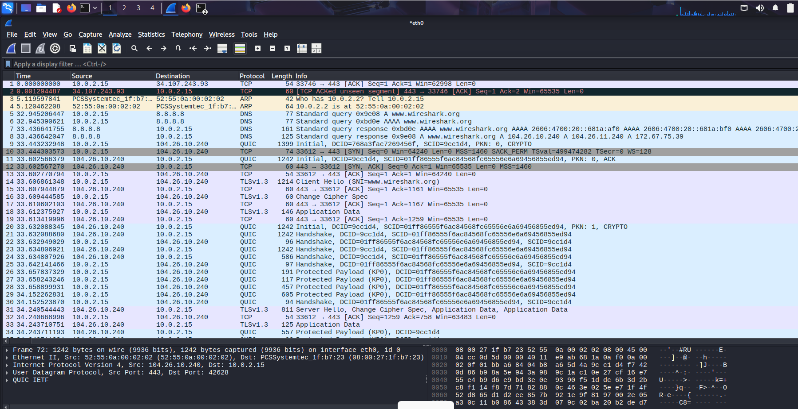
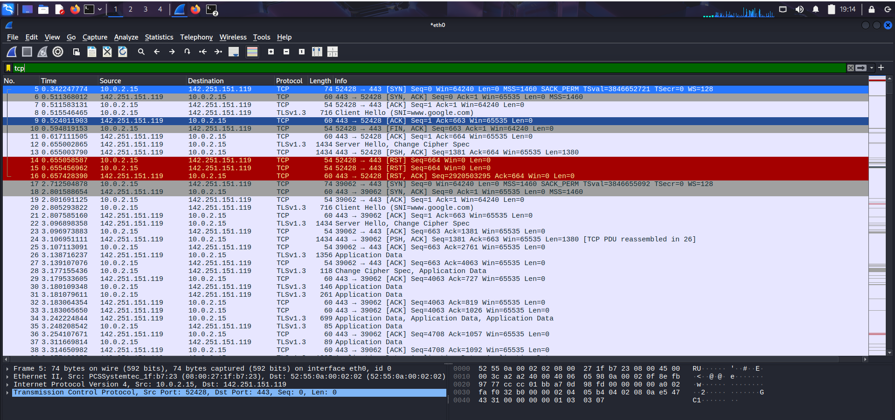
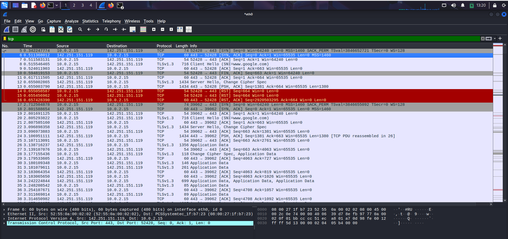
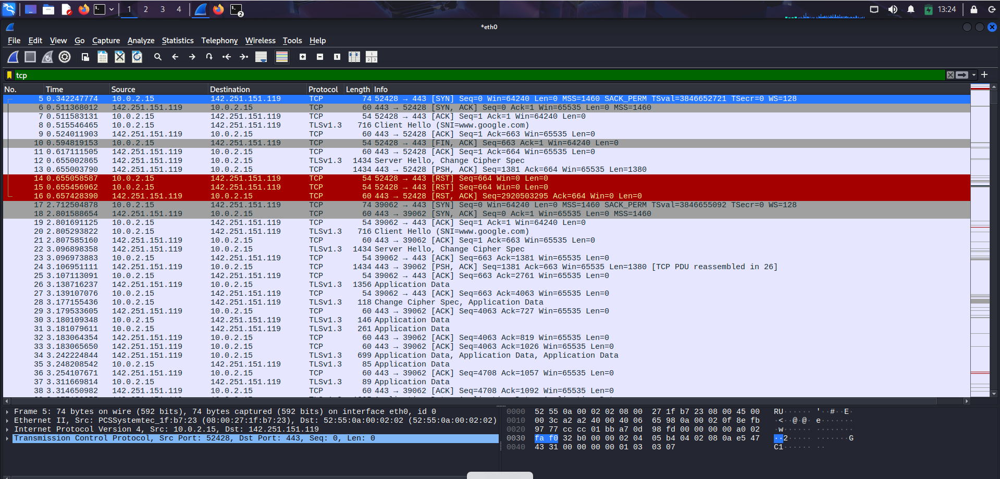
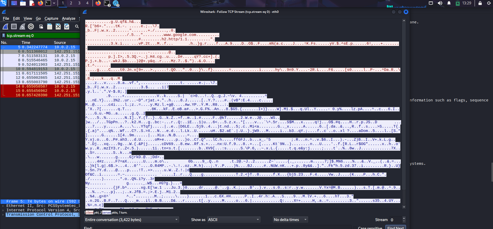

### Step 11 to 15: Analyzing Unencrypted HTTP Traffic
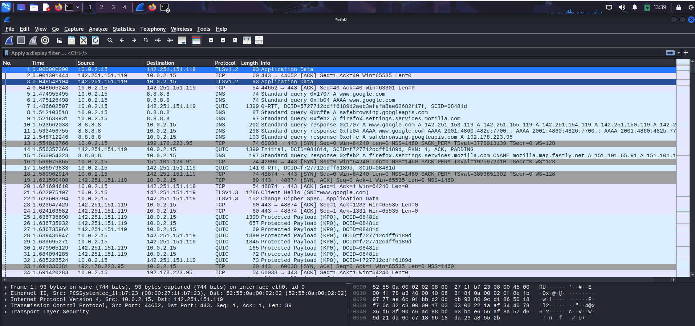
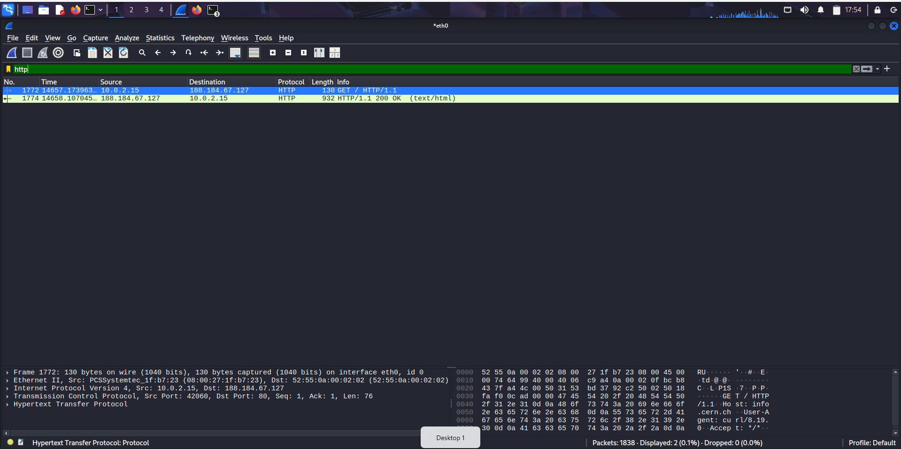
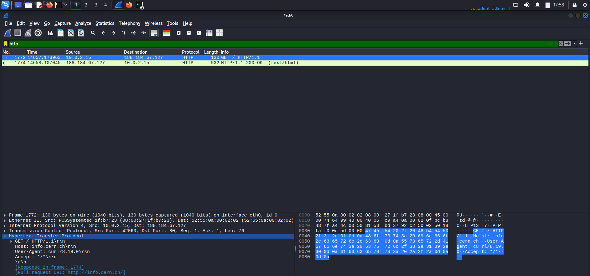
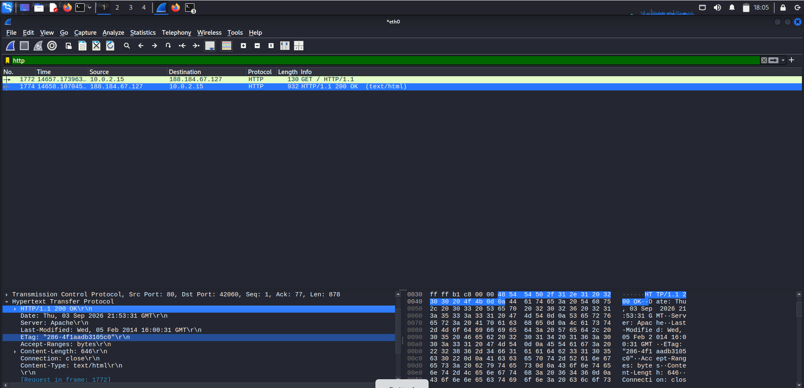
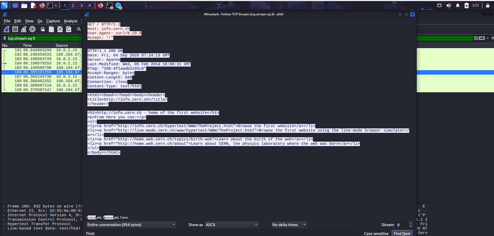

### Step 16 to 21: Analyzing Encrypted TLS Traffic
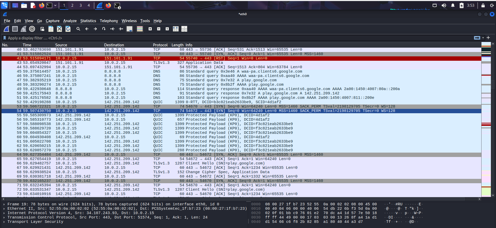
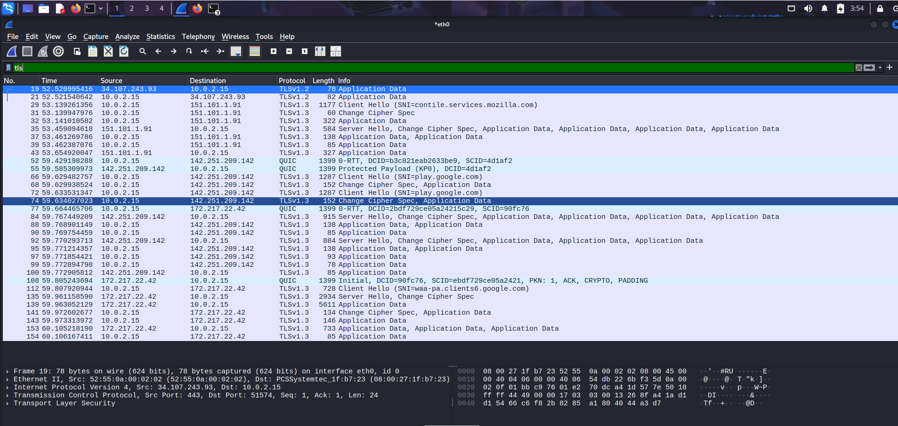
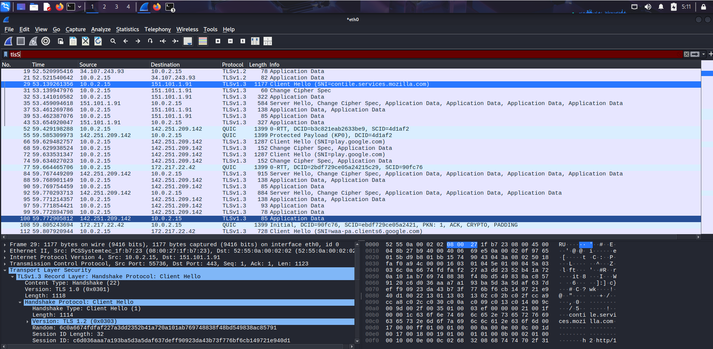
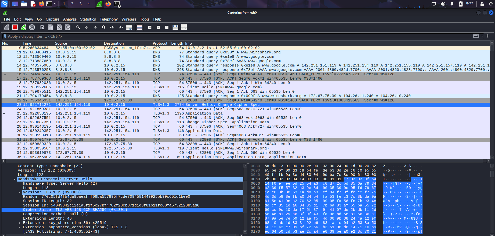
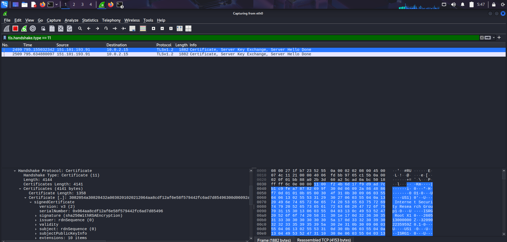
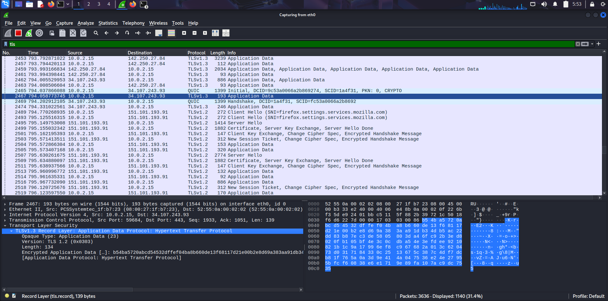

---

## Conclusion: HTTP vs. TLS Comparison
By comparing the traffic streams, the security benefits of TLS are highly visible:
*   **HTTP Traffic (Unencrypted):** Following the stream revealed the payload in **plaintext**. The exact HTML code, headers, and website content were perfectly readable to anyone monitoring the network.
*   **TLS Traffic (Encrypted):** The payload was classified as **Encrypted Application Data**. Instead of readable code, the packet only contained random, scrambled ciphertext. Because the data is locked behind the Cipher Suite agreed upon during the handshake, a network eavesdropper cannot read or manipulate the actual contents of the communication.